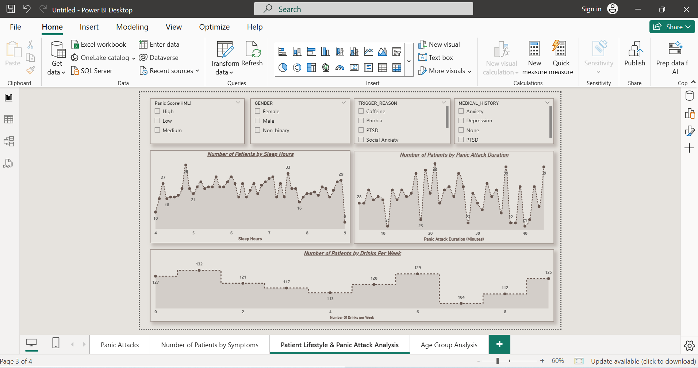
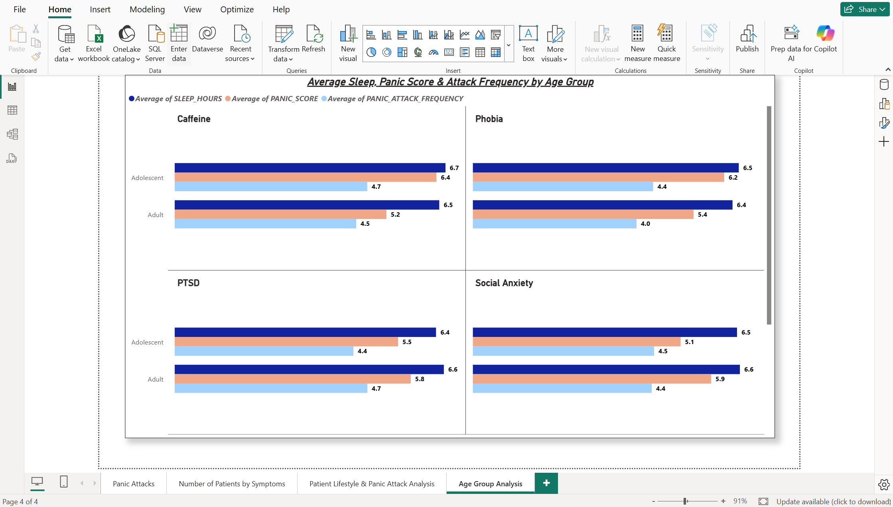

# 🧠 Panic Attacks Analysis – Power BI + Snowflake SQL

An interactive *Power BI Dashboard* analyzing panic attack patterns, symptoms, and lifestyle factors, with *Snowflake SQL* used as the cloud data source.

---

## 📊 Dashboard Pages
### 1️⃣ Symptoms Analysis  
Counts of patients experiencing:
- Dizziness  
- Trembling  
- Sweating  
- Chest Pain  
- Breathlessness  

### 2️⃣ Lifestyle & Panic Attack Analysis  
Visuals showing:
- Average Sleep Hours  
- Panic Attack Duration (Minutes)  
- Drinks per Week  
- Slicers for Gender, Medical History, Trigger Reason, Panic Score Category (Low / Medium / High)

### 3️⃣ Age Group Analysis  
Comparison of:
- Average Panic Score  
- Average Sleep Hours  
- Attack Frequency  
across different age groups and triggers (e.g., Caffeine, PTSD, Phobia, Social Anxiety)

---

## 🛠 Tools & Skills
- *Snowflake SQL* – Used as cloud database (Database + Table + Warehouse setup)
- *Power BI* – Data cleaning (Power Query), DAX calculations, and interactive dashboard design
- *DAX* – Custom measures (Panic Score Categorization, % of Patients by Symptom)

---

## 📷 Screenshots
### Symptoms Analysis

### Lifestyle & Panic Attack Analysis

### Age Group Analysis

---

## 🎥 Demo Video
[▶️ Watch Demo](https://drive.google.com/file/d/1opFxUw1BjnNn92bUDcZH8K72iUwGOVns/view?usp=sharing)  
A short walkthrough of the dashboard and insights.

---

## 🔗 Links
- *LinkedIn:* [LinkedIn Profile](https://www.linkedin.com/in/ahmed-ghonem-94960a381/)
- *Xing:* [Xing Profile](https://www.xing.com/profile/Ahmed_Ghonem096187/web_profiles)

